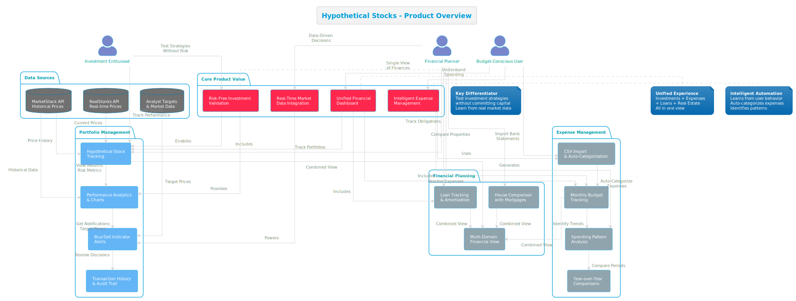
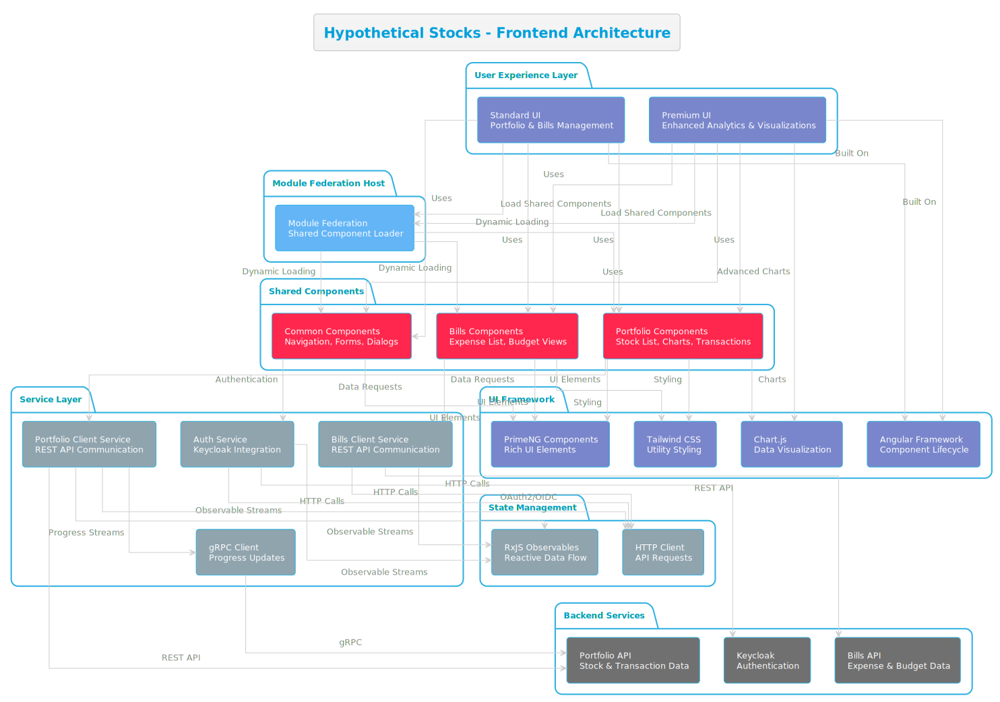
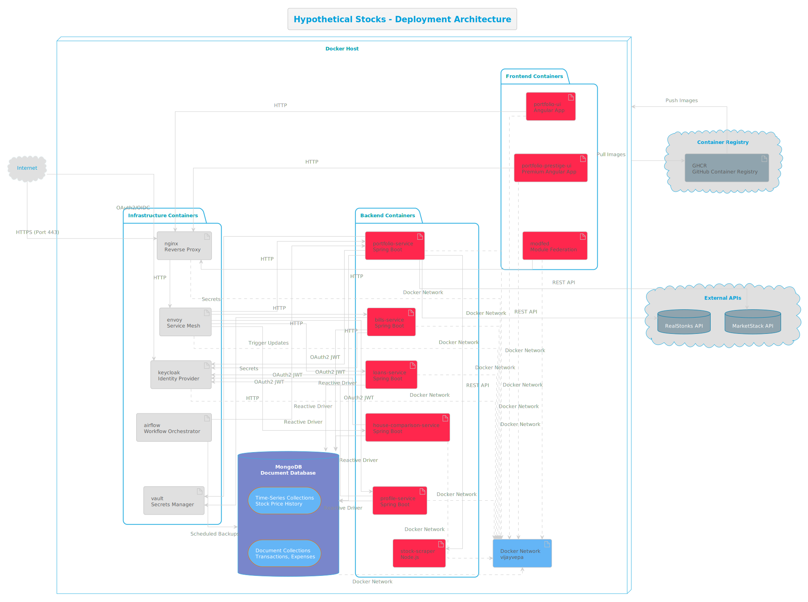

# Hypothetical Stocks

A comprehensive personal finance management platform that enables users to track investment portfolios, manage expenses, and make informed financial decisions through real-time market data integration and intuitive analytics.

NOTE: Full Code available in a [Private Repo](https://github.com/vijayvepa/HypotheticalStocks).I can share upon request.

## Purpose

Hypothetical Stocks addresses the challenge of fragmented personal finance management by providing a unified platform for tracking investments, monitoring expenses, and analyzing financial performance. The system integrates multiple external data sources to deliver real-time stock prices, analyst targets, and market insights, enabling users to make data-driven investment decisions. Unlike traditional portfolio trackers, this platform emphasizes hypothetical trading scenarios—allowing users to track "what-if" investments without actual capital commitment, while providing comprehensive analytics on potential returns, risk assessment, and performance metrics.

## Engineering Story

This project emerged from the need to validate investment strategies and track financial performance across multiple domains—stocks, expenses, loans, and real estate—in a single cohesive system. The core challenge was integrating diverse data sources (market APIs, user transactions, expense records) while maintaining real-time accuracy and providing actionable insights.

**Key Design Decisions:**
- **Microservices Architecture**: Domain separation (portfolio, bills, loans, house-comparison) enables independent scaling and technology choices while maintaining clear boundaries
- **Reactive Programming Model**: Spring WebFlux and reactive MongoDB drivers support high-concurrency scenarios when processing bulk stock price updates and user requests
- **Multi-Provider Strategy**: Abstracting stock price providers (MarketStack, RealStonks, Stock Scraper) allows graceful degradation and provider switching without system-wide changes
- **Module Federation**: Frontend architecture supports multiple UI experiences (standard and premium) while sharing core components, enabling A/B testing and gradual feature rollout

**What This Project Validated:**
- Reactive patterns effectively handle high-volume, real-time data ingestion from external APIs
- Domain-driven design principles scale well when adding new financial domains (bills, loans, house comparison)
- Containerized deployment with Docker Compose provides sufficient orchestration for development and small-scale production without Kubernetes complexity
- Keycloak-based authentication with policy enforcement enables fine-grained authorization across services without tight coupling

## Product Vision

Hypothetical Stocks empowers individuals to make informed financial decisions through a unified platform that bridges the gap between investment tracking and expense management. The product addresses a critical pain point: most financial tools treat investments and expenses as separate domains, making it difficult to understand overall financial health and make strategic decisions.



**Product Overview Diagram Notes:**
- **User Personas**: Three primary user types (Investment Enthusiast, Budget-Conscious User, Financial Planner) each have distinct needs and workflows
- **Core Product Value**: Four foundational value propositions (Risk-Free Investment Validation, Unified Financial Dashboard, Real-Time Market Data Integration, Intelligent Expense Management) address key user pain points
- **Portfolio Management**: Features include hypothetical stock tracking, performance analytics with charts, buy/sell indicator alerts, and comprehensive transaction history
- **Expense Management**: Capabilities span CSV import with auto-categorization, monthly budget tracking, spending pattern analysis, and year-over-year comparisons
- **Financial Planning**: Tools for loan tracking with amortization, house comparison with mortgage calculations, and a unified multi-domain financial view
- **Data Sources**: Integration with MarketStack (historical prices), RealStonks (real-time prices), and analyst target data powers the platform's intelligence
- **User Journeys**: The diagram shows how different user types interact with features, from adding stocks and tracking performance (Investment Enthusiast) to importing expenses and analyzing patterns (Budget-Conscious User) to comprehensive financial planning (Financial Planner)

Source for the diagram: **`docs/product-overview.puml`** (PlantUML; generate PNG from it for docs or slides).

### Core Value Propositions

**Risk-Free Investment Validation**: Users can test investment strategies without committing capital, tracking hypothetical portfolios with real market data to validate their decision-making process before investing real money.

**Unified Financial View**: Unlike siloed tools that require switching between multiple applications, Hypothetical Stocks provides a single dashboard showing portfolio performance, expense patterns, loan obligations, and real estate considerations in one cohesive view.

**Data-Driven Insights**: The platform integrates multiple market data sources to provide real-time stock prices, analyst targets, and historical performance metrics, enabling users to make decisions based on comprehensive market intelligence rather than gut feelings.

**Expense Intelligence**: Beyond simple expense tracking, the system learns from user behavior—automatically categorizing expenses, identifying spending patterns, and providing year-over-year comparisons to help users understand their financial habits.

### Target User Experience

**For Investment Enthusiasts**: Track multiple hypothetical portfolios, compare performance against analyst targets, and receive notifications when stocks reach buy/sell indicators. Visualize portfolio performance with interactive charts showing returns, risk metrics, and transaction history.

**For Budget-Conscious Users**: Import bank statements via CSV, automatically categorize expenses using intelligent rules, and track monthly budgets across multiple categories. Understand spending patterns with visual analytics and identify opportunities for savings.

**For Financial Planners**: Compare real estate options with mortgage calculations, track loan obligations alongside investment returns, and view a comprehensive financial picture that includes assets, liabilities, and cash flow.

### Product Differentiation

- **Hypothetical Trading Focus**: Unlike traditional portfolio trackers that require real transactions, this platform emphasizes "what-if" scenarios, making it ideal for learning, strategy validation, and risk-free experimentation
- **Multi-Domain Integration**: Seamlessly connects investments, expenses, loans, and real estate in a single platform, providing holistic financial visibility
- **Real-Time Market Data**: Integrates multiple price providers with automatic failover, ensuring users always have access to current market data
- **Progressive User Experience**: Two UI variants (standard and premium) allow users to start simple and upgrade to advanced analytics as their needs grow

## Architecture

The system follows a **microservices architecture** with clear domain boundaries, unified authentication, and shared infrastructure components.


**Architecture Diagram Notes:**
- **User Interface Layer**: Two Angular applications (standard and premium) provide different user experiences, with module federation enabling component sharing
- **API Gateway Layer**: Envoy proxy handles advanced routing and service mesh capabilities, while Nginx provides SSL termination and static asset serving
- **Business Logic Layer**: Domain-specific services (portfolio, bills, loans, house-comparison, profile) each own their business logic and data models
- **Data Layer**: MongoDB serves as the primary data store with reactive access patterns for high-concurrency scenarios
- **External Integration Layer**: Multiple stock price providers (MarketStack, RealStonks, Stock Scraper) enable graceful degradation and provider switching
- **Infrastructure Services**: Keycloak provides centralized authentication, Airflow orchestrates scheduled tasks, and Vault secures sensitive configuration

Source for the diagram: **`docs/architecture.puml`** (PlantUML; generate PNG from it for docs or slides).

### High-Level Data Flow

1. **User Interface Layer**: Two Angular applications (standard and premium UI) provide different user experiences while sharing core functionality through module federation
2. **API Gateway Layer**: Envoy proxy and Nginx handle routing, load balancing, and SSL termination, directing requests to appropriate backend services
3. **Business Logic Layer**: Domain-specific services (portfolio, bills, loans, house-comparison, profile) process requests, enforce business rules, and coordinate with external data sources
4. **Data Layer**: MongoDB stores domain-specific data (stocks, transactions, expenses, user preferences) with reactive access patterns
5. **External Integration Layer**: Multiple stock price providers (MarketStack, RealStonks, Stock Scraper) supply real-time and historical market data
6. **Infrastructure Services**: Keycloak manages authentication and authorization, Airflow orchestrates scheduled data updates, and Vault secures sensitive configuration

### Component Roles

- **Portfolio Service**: Manages stock tracking, transaction history, fund allocation, and performance analytics. Integrates with multiple price providers to fetch current and historical stock data
- **Bills Service**: Handles expense tracking, monthly budgeting, bank account management, and expense categorization with import/export capabilities
- **Loans Service**: Tracks loan details, payment schedules, and amortization calculations
- **House Comparison Service**: Enables side-by-side comparison of real estate properties with mortgage calculations
- **Profile Service**: Manages user authentication, preferences, and profile data, integrating with Keycloak for identity management
- **Stock Scraper Service**: Node.js service that scrapes stock prices from Google Finance and Yahoo Finance as a fallback provider
- **Common Module**: Shared authentication, security configuration, and cross-cutting concerns used by all backend services

## Frontend Architecture

The frontend consists of two Angular applications built with modern web technologies, emphasizing component reusability, responsive design, and real-time data visualization.



**Frontend Architecture Diagram Notes:**
- **User Experience Layer**: Two distinct Angular applications (standard and premium UI) provide different user experiences while sharing core functionality
- **Module Federation Host**: Enables dynamic loading of shared components across both UI applications, reducing code duplication and enabling A/B testing
- **Shared Components**: Reusable portfolio, bills, and common components are loaded on-demand, ensuring consistent UX across both applications
- **Service Layer**: Client services handle REST API communication, authentication, and gRPC-based progress updates for long-running operations
- **State Management**: RxJS observables provide reactive data flow, while HTTP client manages API requests with built-in error handling
- **UI Framework**: Angular provides component lifecycle management, PrimeNG delivers rich accessible components, Tailwind CSS enables utility-first styling, and Chart.js powers data visualizations
- **Backend Integration**: Services communicate with portfolio API, bills API, and Keycloak authentication service via REST and OAuth2/OIDC protocols

Source for the diagram: **`docs/frontend-architecture.puml`** (PlantUML; generate PNG from it for docs or slides).

### Technology Stack

- **Framework**: Angular 16 with TypeScript
- **UI Libraries**: PrimeNG component library for rich, accessible components; Tailwind CSS for utility-first styling
- **State Management**: RxJS observables for reactive data flow and HTTP client for API communication
- **Visualization**: Chart.js for portfolio performance charts, transaction timelines, and expense analytics
- **Module Federation**: Modern.js-based module federation enables code sharing between the standard and premium UI experiences

### Key Frontend Capabilities

- **Portfolio Dashboard**: Real-time stock price display, transaction history, portfolio performance charts, and buy/sell indicator tracking
- **Expense Management**: Monthly expense tracking with CSV import, category management, payee tracking, and budget analysis
- **Responsive Design**: Mobile-first approach with adaptive layouts for desktop, tablet, and mobile devices
- **Real-time Updates**: WebSocket-like patterns (via polling) for live price updates and progress indicators during bulk operations
- **User Experience**: PrimeNG components provide consistent, accessible UI patterns with built-in validation and error handling

### Frontend Services

- **portfolio-ui**: Standard Angular application with Tailwind CSS styling, focused on core portfolio and expense management features
- **portfolio-prestige-ui**: Premium UI experience built on PrimeNG Prestige template, offering enhanced visualizations and advanced analytics
- **federation/modfed**: Module federation host application enabling shared component loading and micro-frontend architecture

## Backend Architecture

The backend is built on **Spring Boot 3** with a reactive programming model, emphasizing scalability, resilience, and domain-driven design principles.

### Technology Stack

- **Framework**: Spring Boot 3.1.3 with Spring WebFlux for reactive HTTP handling
- **Language**: Java 17 with modern language features
- **Database**: MongoDB with reactive drivers (Spring Data MongoDB Reactive) for non-blocking data access
- **Communication**: REST APIs for HTTP requests, gRPC for internal service communication and progress updates
- **Authentication**: Keycloak integration with OAuth2 JWT tokens and policy-based authorization
- **External APIs**: Integration with MarketStack, RealStonks, and custom Stock Scraper service for market data

### Key Backend Capabilities

- **Reactive Data Processing**: Non-blocking I/O handles concurrent requests efficiently, particularly during bulk stock price updates
- **Multi-Provider Abstraction**: Stock price provider interface allows switching between MarketStack, RealStonks, and Stock Scraper without code changes
- **Domain-Driven Design**: Each service (portfolio, bills, loans, house-comparison) owns its data model and business logic, enabling independent evolution
- **Transaction Management**: Comprehensive transaction logging tracks all portfolio changes, enabling audit trails and historical analysis
- **Progress Tracking**: gRPC-based progress updates provide real-time feedback during long-running operations (e.g., bulk stock price updates)

### Backend Services

- **Portfolio Service**: Core investment tracking with stock management, ticker tracking, fund allocation, and performance calculations. Handles split adjustments, dividend tracking, and analyst target price monitoring
- **Bills Service**: Expense and budget management with bank account tracking, monthly expense aggregation, and import rule processing for automated categorization
- **Loans Service**: Loan tracking and amortization calculations
- **House Comparison Service**: Real estate comparison with mortgage calculations
- **Profile Service**: User management and authentication coordination with Keycloak
- **Stock Scraper Service**: Node.js/Express service providing fallback stock price data via web scraping

### Data Models

- **Portfolio Domain**: Stocks, Tickers, User Stocks, Funds, Transaction Logs
- **Bills Domain**: Banks, Payees, Months, Expenses, Bills, Import Rules, Category Settings
- **Common Patterns**: Reactive repositories, domain events, and shared authentication context

## DevOps & Infrastructure

The infrastructure emphasizes containerization, service orchestration, and secure configuration management, supporting both local development and production deployments.



**Deployment Diagram Notes:**
- **Docker Host**: All services run as containers on a single Docker host, connected via custom Docker network (`vijayvepa`) for service discovery
- **Frontend Containers**: Three Angular applications (portfolio-ui, portfolio-prestige-ui, modfed) serve different user experiences
- **Backend Containers**: Five Spring Boot services (portfolio, bills, loans, house-comparison, profile) plus Node.js stock-scraper service handle business logic
- **Infrastructure Containers**: Nginx and Envoy provide API gateway functionality, Keycloak manages identity, Airflow orchestrates workflows, and Vault secures secrets
- **MongoDB**: Document database with time-series collections for stock price history and standard collections for transactions and expenses
- **External APIs**: MarketStack and RealStonks provide stock price data, accessed via REST APIs
- **Container Registry**: GitHub Container Registry (GHCR) stores and distributes container images

Source for the diagram: **`docs/deployment.puml`** (PlantUML; generate PNG from it for docs or slides).

### Technology Stack

- **Containerization**: Docker with multi-stage builds for optimized image sizes
- **Orchestration**: Docker Compose for local development and service coordination
- **API Gateway**: Envoy proxy for advanced routing, load balancing, and service mesh capabilities; Nginx for SSL termination and static asset serving
- **Identity Management**: Keycloak for centralized authentication and authorization with OAuth2/OIDC support
- **Data Orchestration**: Apache Airflow for scheduling data backups, exports, and periodic stock price updates
- **Secrets Management**: HashiCorp Vault for secure storage of API keys, database credentials, and sensitive configuration
- **Database**: MongoDB with support for time-series collections (for stock price history) and reactive access patterns
- **Container Registry**: GitHub Container Registry (GHCR) for image storage and distribution

### Infrastructure Components

- **Network Layer**: Custom Docker network (`vijayvepa`) enables service discovery and inter-service communication
- **MongoDB**: Document database with export/import scripts for data migration and backup
- **Keycloak**: Identity provider with realm-based configuration, supporting multiple authentication methods and fine-grained authorization policies
- **Envoy Proxy**: Service mesh proxy handling request routing, retries, circuit breaking, and observability
- **Nginx**: Reverse proxy and load balancer with SSL/TLS termination, serving as entry point for external traffic
- **Airflow**: Workflow orchestration for scheduled tasks (MongoDB backups, data exports, stock price updates)
- **Vault**: Secrets management with Kubernetes and Azure integrations for production deployments

### Deployment Strategy

- **Local Development**: Docker Compose orchestrates all services with volume mounts for hot-reloading and development databases
- **Container Builds**: Multi-stage Docker builds create layered JARs for Spring Boot applications, optimizing image size and startup time
- **Service Deployment**: Individual services include deployment scripts (`DockerCompose.sh`, `Deploy.sh`) for consistent deployment patterns
- **Version Management**: Version files (`VERSION`) track service versions, enabling rollback capabilities
- **Azure Integration**: Infrastructure-as-code for Azure Container Apps, Key Vault, and MongoDB Atlas deployments

### Observability & Operations

- **Logging**: Structured logging with configurable log rotation (max-size, max-file) for container logs
- **Health Checks**: Container health checks ensure service availability and automatic restart on failures
- **Data Backup**: Automated MongoDB export scripts with Airflow orchestration for scheduled backups
- **Configuration Management**: Environment-based configuration with profile support (local, nginx, production)

## Workflow

### User Journey: Tracking a Hypothetical Investment

1. **User Authentication**: User logs in through Keycloak, receiving a JWT token with authorization claims
2. **Stock Selection**: User searches for a stock ticker and adds it to their watchlist
3. **Hypothetical Purchase**: User creates a hypothetical transaction with purchase date, price, and quantity
4. **Price Monitoring**: System periodically fetches current stock prices from configured providers (MarketStack, RealStonks, or Stock Scraper)
5. **Performance Calculation**: Backend calculates current value, profit/loss, percentage change, and days since purchase
6. **Analytics Display**: Frontend displays portfolio performance charts, transaction history, and buy/sell indicators based on analyst targets
7. **Notifications**: System tracks when stocks meet target prices and notifies users (planned feature)

### Data Pipeline: Stock Price Updates

1. **Scheduled Trigger**: Airflow DAG triggers periodic stock price updates
2. **Provider Selection**: System selects appropriate price provider based on configuration (MarketStack for historical, RealStonks for real-time)
3. **Bulk Processing**: Backend processes multiple tickers concurrently using reactive streams
4. **Progress Updates**: gRPC service streams progress updates to frontend during long-running operations
5. **Data Persistence**: Updated prices stored in MongoDB, with time-series collections for historical data
6. **Cache Invalidation**: Frontend refreshes affected portfolio views with updated prices

## Key Features

### Portfolio Management
- **Stock Tracking**: Add stocks to watchlist with purchase price and analyst target tracking
- **Transaction History**: Complete audit trail of all hypothetical buy/sell transactions
- **Performance Analytics**: Real-time calculation of profit/loss, percentage returns, and portfolio-level metrics
- **Fund Management**: Allocate and track funds across different investment strategies
- **Price Alerts**: Monitor when stocks reach analyst target prices (buy/sell indicators)

### Expense Management
- **Monthly Budgeting**: Track expenses by month with category-based organization
- **CSV Import**: Bulk import expenses from bank statements with automated categorization rules
- **Payee Management**: Track recurring payees and automate expense matching
- **Bank Account Integration**: Manage multiple bank accounts and track balances
- **Expense Analytics**: Year-over-year comparisons and category spending trends

### Financial Planning
- **Loan Tracking**: Monitor loan details, payment schedules, and amortization
- **House Comparison**: Side-by-side comparison of real estate properties with mortgage calculations
- **Multi-Domain View**: Unified dashboard showing portfolio, expenses, and loans in one view

## Setup / Quick Start

### Prerequisites

- Java 17 (use SDKMAN: `sdk default java 17.0.0-tem`)
- Docker and Docker Compose
- Node.js 16+ (for frontend development)
- Angular CLI 16.1.8 (for frontend development)

### Local Development

1. **Start Infrastructure Services**:
   ```bash
   cd infra
   sh Network.sh  # Create Docker network
   cd mongo && sh DockerCompose.sh
   cd ../keycloak && sh DockerCompose.sh
   cd ../nginx && sh DockerCompose.sh
   ```

2. **Build and Start Backend Services**:
   ```bash
   mvn clean install  # Build all modules
   cd portfolio && sh DockerCompose.sh
   cd ../bills && sh DockerCompose.sh
   # Repeat for other services
   ```

3. **Start Frontend**:
   ```bash
   cd portfolio-ui
   npm ci
   ng serve  # Runs on http://localhost:4200
   ```

4. **Deploy All Services** (alternative):
   ```bash
   sh deploy-all.sh  # Orchestrates deployment of all services
   ```

### Environment Configuration

- Configure Keycloak realm settings in `infra/keycloak/realm-import.json`
- Set API keys for stock price providers (MarketStack, RealStonks) in service configuration
- Configure MongoDB connection strings in service `application.yml` files
- Set allowed CORS origins in backend service configuration

## Why This Project Matters

### Strategic Value

This project demonstrates **full-stack engineering capabilities** across modern web technologies, microservices architecture, and cloud-native infrastructure. It showcases the ability to integrate multiple external data sources, handle real-time data processing, and deliver a cohesive user experience across complex financial domains.

### Learning Outcomes

- **Reactive Programming**: Practical application of Spring WebFlux and reactive MongoDB drivers for high-concurrency scenarios
- **Microservices Patterns**: Domain-driven design, service boundaries, and inter-service communication (REST, gRPC)
- **Modern Frontend Architecture**: Module federation, component reusability, and responsive design patterns
- **DevOps Practices**: Containerization, service orchestration, secrets management, and infrastructure-as-code
- **Integration Challenges**: Handling multiple external APIs, graceful degradation, and provider abstraction

### Technical Highlights

- **Scalability**: Reactive architecture supports high-volume concurrent requests without thread pool exhaustion
- **Resilience**: Multi-provider strategy for stock prices ensures system availability even if one provider fails
- **Security**: Keycloak-based authentication with policy enforcement provides enterprise-grade authorization
- **Developer Experience**: Docker Compose setup enables local development with production-like infrastructure
- **Extensibility**: Domain-driven design allows adding new financial domains (e.g., crypto, options) without modifying existing services

---

## Timeline

| Month | Milestone |
|-------|-----------|
| **September 2023** | Project initialization: Spring Boot setup, Docker configuration, initial portfolio domain implementation, stock tracking with buy/sell transactions, house comparison service foundation |
| **October 2023** | Bills domain implementation: expense tracking, bank account management, monthly budgeting; portfolio grouping and multi-portfolio support |
| **November 2023** | Portfolio-level calculations refinement, bills copy functionality, matching bills updates |
| **December 2023** | Keycloak authentication integration: OAuth2/OIDC setup, realm configuration, authorization in WebFlux services, UI authentication flow |
| **January 2024** | Profile service separation, price history consolidation, target price history tracking, authorization integration across services |
| **February 2024** | Price history features: share price history across users, download price history on stock induct, progress indicators for bulk operations; profile service extraction; house comparison enhancements |
| **March 2024** | Stock split factor handling, monthly budget implementation, stock scraper service integration (MarketStack, RealStonks, Yahoo Finance) |
| **April 2024** | Loans domain implementation: loan tracking, persistence, remaining balance calculations; long-term budget features |
| **May 2024** | Stock split calculation fixes, MongoDB export/import scripts, stock scraper Yahoo Finance fixes |
| **June 2024** | Docker deployment automation: build, tag, push, and compose scripts; layered Docker images; infrastructure MongoDB integration |
| **July 2024** | Nginx reverse proxy setup, production deployment profiles, authentication fixes for containerized environment, portfolio-prestige-ui Docker builds |
| **August 2024** | Loans service containerization |
| **September 2024** | Azure cloud deployment: MongoDB Atlas setup, Keycloak deployment, Azure Key Vault integration, container app deployments |
| **October 2024** | Google authentication integration, profile information API, end-to-end testing for loans service, portfolio Azure deployment |
| **June 2025** | Versioned deployment system, UI rollback capabilities |
| **July 2025** | Loans micro-frontend implementation with Next.js |
| **September 2025** | Apache Airflow integration for data orchestration, automated exports, scheduled backups |
| **October 2025** | Theme persistence and user preferences management |
