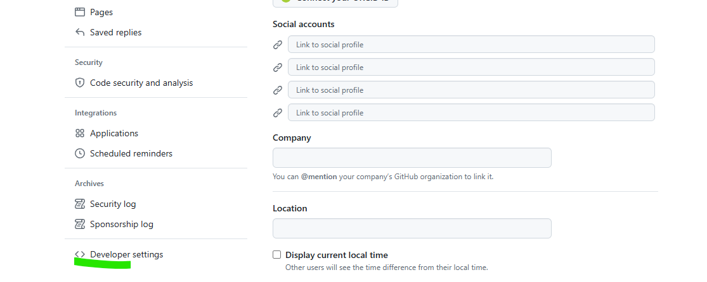
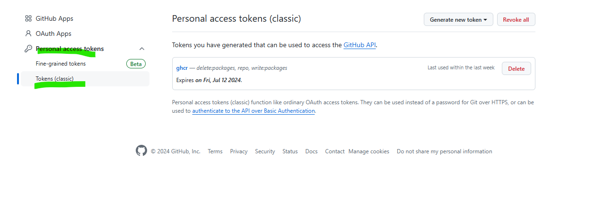
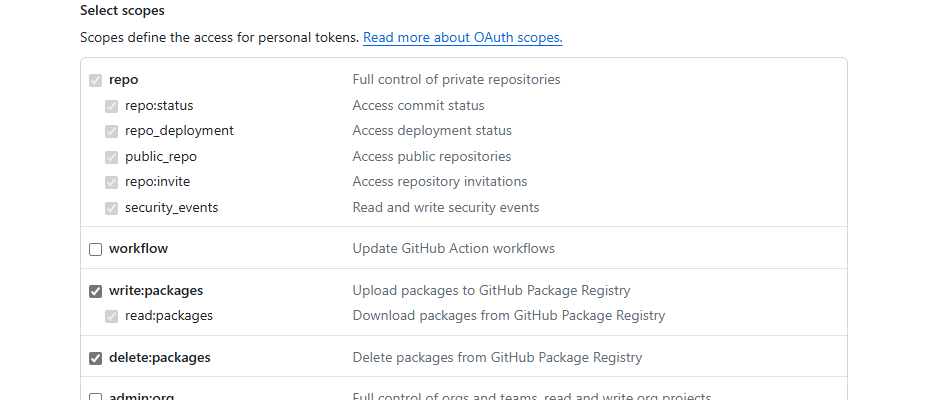

# Container Registry

- View [Packages](https://github.com/vijayvepa?tab=packages)
- Add following to `ContainerRegistry.env`

```env
GHCR_TOKEN=<<personal access token from github>>
```

## Create [Personal Access Token](https://github.com/settings/tokens)

- Go to github.com, login
- Click on your Profile -> Settings   
  

- Developer Settings
  

- Go to Personal Access Tokens -> Tokens (classic)
  
- Generate new token with permissions for packages



